<br>

<div align="center">


# Loo
### Find a clean washroom in Dhaka — fast.

*Community-powered · Free forever · Built for Bangladesh*

[](https://developer.apple.com/ios/)
[](https://swift.org)
[](https://developer.apple.com/xcode/swiftui/)
[](https://maplibre.org)
[](https://github.com/siraajul/Loo/pulls)
[](LICENSE)

</div>

---

> **Finding a clean public washroom in Dhaka is hard.**  
> Dead apps, outdated listings, zero community input.  
> Loo fixes that — open-source, OSM-powered, built by the community for the city.

---

## ✨ What it does

| Feature | Description |
|---|---|
| 🗺 **Live OSM Map** | OpenStreetMap tiles via MapLibre — no Google, no fees, always up to date |
| 💧 **Liquid Glass UI** | iOS 26 floating Liquid Glass top bar — search, filter, profile pills over the map |
| 📍 **Locate Me** | Tap to recenter on yourself anytime; auto-center on first GPS fix |
| 🧭 **Compass Finder** | Real-time rotating arrow guides you turn-by-turn with haptic pulses as you get closer |
| 📋 **Nearby Sheet** | 5 closest washrooms sorted by live GPS distance, updating as you move |
| 🚺 **Women-Friendly Badge** | At-a-glance pink/grey pill on every listing — no more guessing |
| 🌈 **Hijra-Inclusive** | Bangladesh's third gender is a first-class category, with its own marker color |
| 🕌 **Wudu Area** | Mosques expose whether ritual ablution facilities are available |
| 👶 **Baby Changing & Menstrual Products** | Surfaced as filterable amenities, not buried metadata |
| ✅ **Freshness Signal** | "Verified recently / this month / old / unverified" pill — community trust at a glance |
| ⏰ **Open Now** | Live parse of opening hours (`24/7` or `HH:mm-HH:mm`) — filter and chip in detail |
| 🧼 **Cleanliness Score** | Separate sub-rating from overall rating, color-coded |
| 🎛 **Real Filters** | Gender, women-friendly, accessible, free, open-now, amenities — actually applied to map + list |
| ➕ **Submit a Washroom** | Crowdsource new locations with map preview |
| 🔐 **Auth** | Phone OTP sign-in via Supabase — no email required *(backend pending)* |

---

## 📱 Screens

### Onboarding — the first 5 seconds sell the inclusivity story

| Welcome | Built for everyone | Permission priming |
|:---:|:---:|:---:|
| 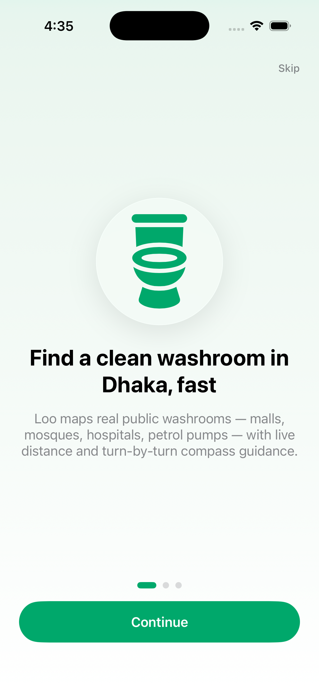 | 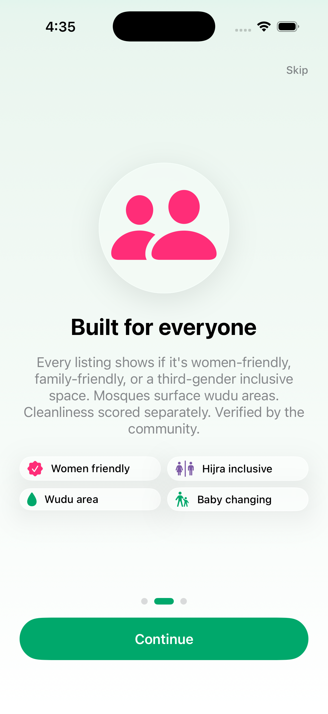 | 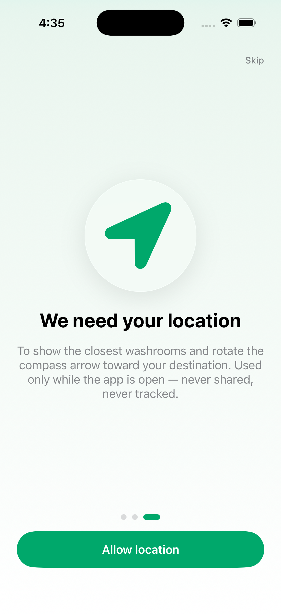 |

### Map — iOS 26 Liquid Glass top bar, floating pills over OpenStreetMap

| First-launch permission prompt | Glass pills + locate-me + nearby sheet |
|:---:|:---:|
| 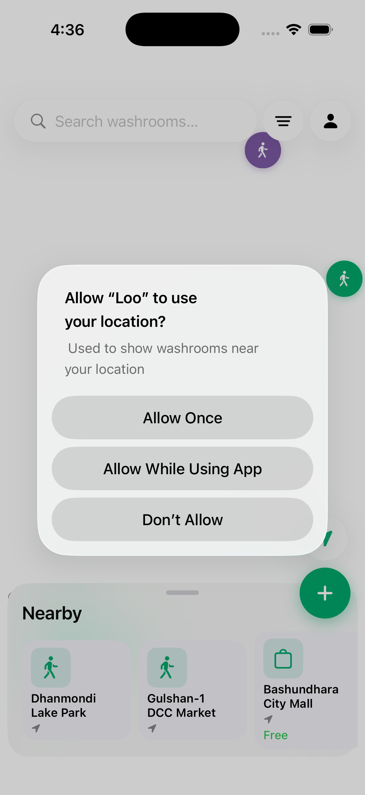 | 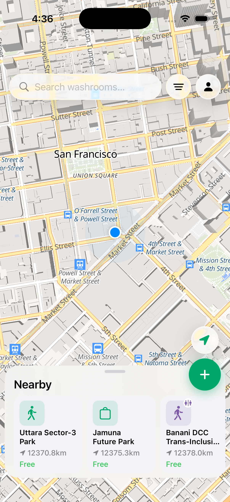 |

### Detail & Finder — at-a-glance trust signals

| Women-friendly · Freshness · Open-now · Cleanliness | Turn-by-turn compass with haptics |
|:---:|:---:|
| 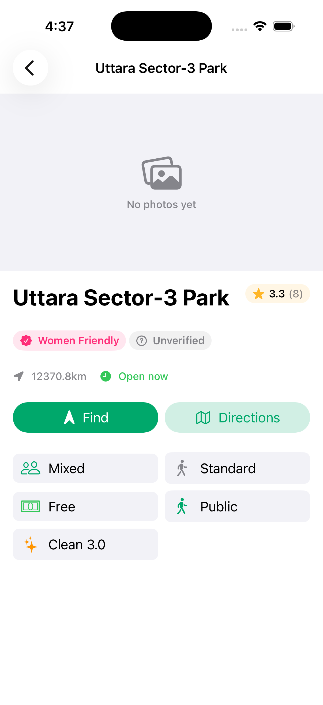 | 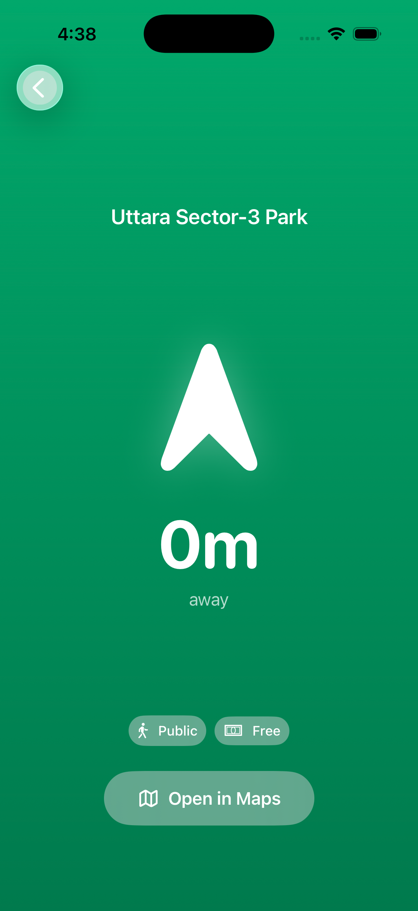 |

### Filters — actually filter the map + nearby list

| Gender · Inclusivity · Accessibility | Amenities · Min rating |
|:---:|:---:|
| 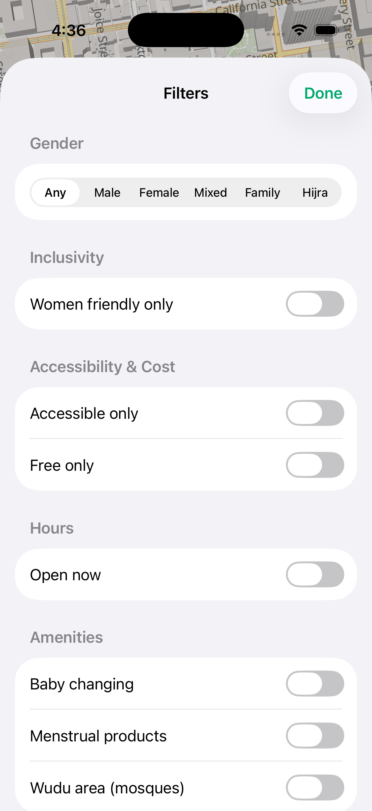 | 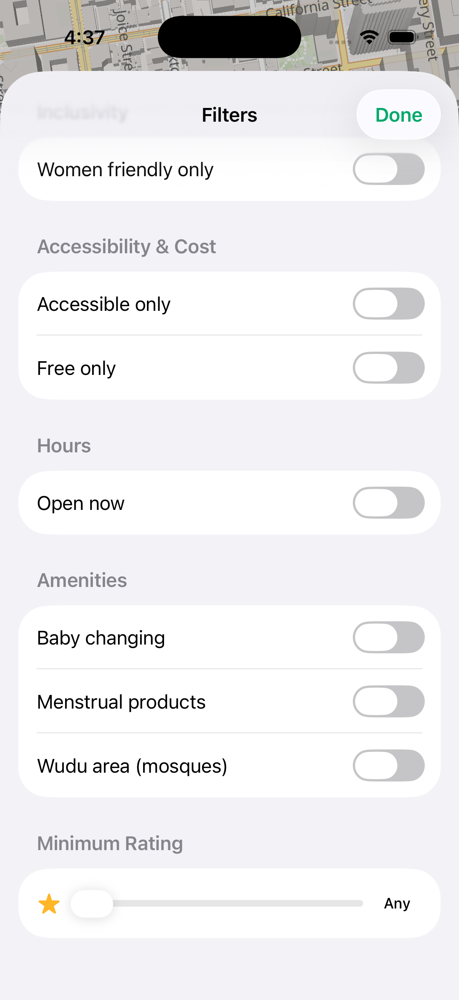 |

### Profile — same Liquid Glass language as onboarding

<p align="center">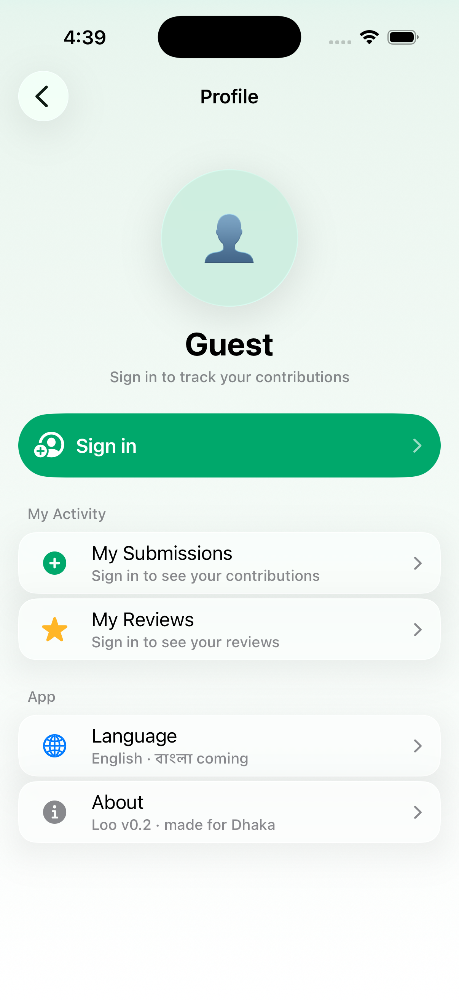</p>

### Submit & Sign-in flow

| Pin a new washroom | Accessibility · Fee · Notes | Sign in (demo) | Phone OTP (demo) |
|:---:|:---:|:---:|:---:|
| 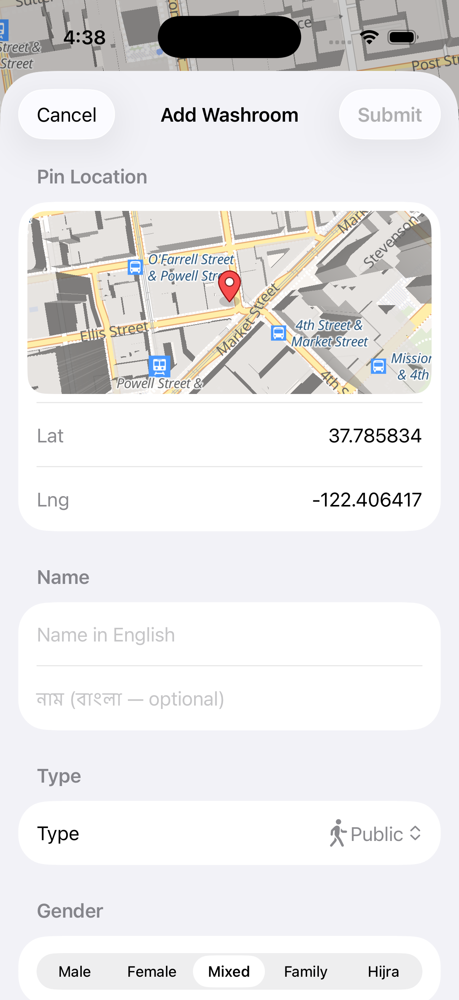 | 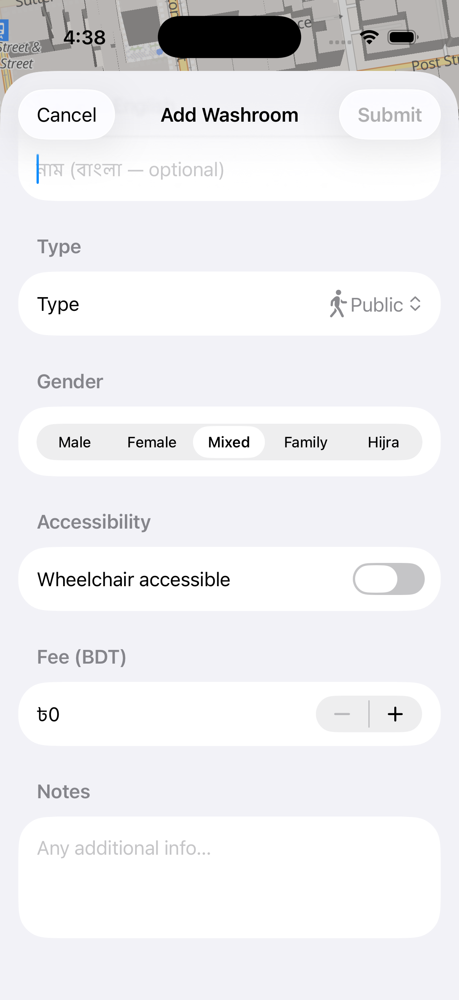 | 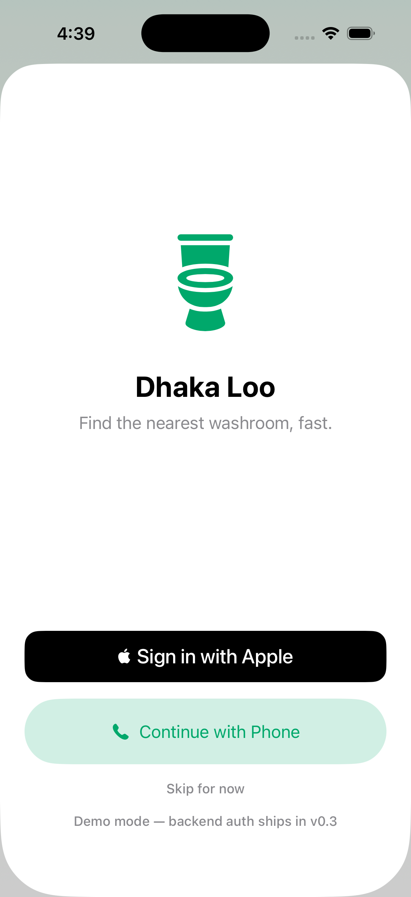 | 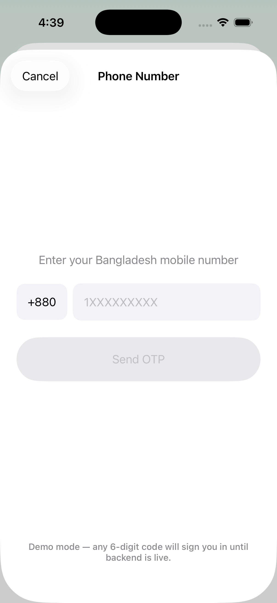 |

---

## 🏗 Architecture

### App Flow


### Data Flow

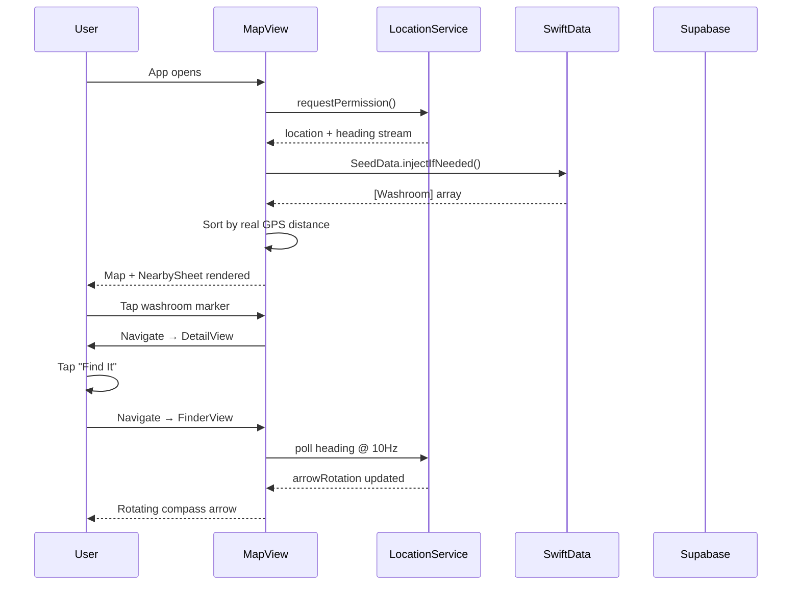

### Layer Diagram

```
┌────────────────────────────────────────────────────┐
│                    SwiftUI Views                   │
│  MapView · DetailView · FinderView · SubmitView    │
├────────────────────────────────────────────────────┤
│                  ViewModels / State                │
│     MapViewModel · FinderViewModel · AppRouter     │
├──────────────────────┬─────────────────────────────┤
│   Core Services      │        Repositories         │
│  LocationService     │  WashroomRepository         │
│  HeadingService      │  SubmissionRepository       │
│  Geo · Formatting    │  AuthRepository             │
├──────────────────────┼─────────────────────────────┤
│   SwiftData (Local)  │   Supabase (Remote)         │
│   Washroom @Model    │   PostgreSQL + Auth + CDN   │
├──────────────────────┴─────────────────────────────┤
│              MapLibre GL Native                    │
│         OpenFreeMap OSM Vector Tiles               │
└────────────────────────────────────────────────────┘
```

---

## 🧠 How the Compass Works

The Finder screen gives you a real-time pointing arrow — no map needed, just walk.

```
arrowRotation = bearing(userLocation → target)  [radians, true north]
              − deviceHeading                    [radians, from CLHeading]
```

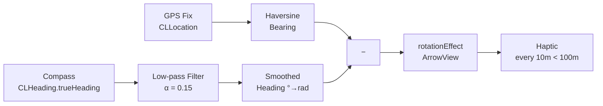

- **Single CLLocationManager** handles both GPS and compass — `trueHeading` is accurate because the same manager has location context for magnetic declination
- **Low-pass filter** smooths compass jitter without introducing noticeable lag
- **Haptic feedback** fires every 10 m bucket when within 100 m of the target

---

## 🗺 Why MapLibre + OpenFreeMap?

| | Google Maps | Apple Maps | **MapLibre + OpenFreeMap** |
|---|---|---|---|
| Cost | 💰 Pay per load | Free (limited) | ✅ **Free forever** |
| Bangladesh coverage | Moderate | Poor | ✅ **Excellent (HOT + OSM)** |
| Offline support | No | Limited | ✅ **Yes** |
| Open source | No | No | ✅ **Yes** |
| Custom styling | Paid | No | ✅ **Yes** |
| API key required | Yes | No | ✅ **No** |

---

## 🚀 Quick Start

### Requirements
- Xcode 26+
- iOS 26+ device (Liquid Glass UI; map tiles + compass need real hardware)
- Swift 6

### Steps

```bash
# 1. Clone
git clone https://github.com/siraajul/Loo.git
cd Loo

# 2. Open in Xcode — MapLibre SPM resolves automatically
open loo.xcodeproj
```

**3. Add location permission** in the target's Build Settings:
```
INFOPLIST_KEY_NSLocationWhenInUseUsageDescription = Used to show washrooms near your location.
```

**4. (Optional) Supabase backend** — add your credentials to:
```swift
// loo/Core/Network/SupabaseClient.swift
let supabaseURL = URL(string: "https://your-project.supabase.co")!
let supabaseKey = "your-anon-key"
```

**5. Run on device** — the app seeds 10 real Dhaka washrooms on first launch so it works immediately, even without a backend.

---

## 🌱 Seed Data (Offline-first)

The app ships with 12 Dhaka washrooms so it's usable from day one — each with realistic hours, freshness dates, and amenity flags:

| Washroom | Type | Gender | Fee | Highlights |
|---|---|---|---|---|
| Bashundhara City Mall | 🏪 Mall | Mixed | Free | 👶 Baby · 🩸 Menstrual · ✨ 4.3 |
| Gulshan-1 DCC Market | 🚻 Public | Mixed | ৳5 | Verification aging |
| Jamuna Future Park | 🏪 Mall | Mixed | Free | 👶 Baby · 🩸 Menstrual · ✨ 4.6 |
| Baitul Mukarram Mosque | 🕌 Mosque | Male | Free | 🕌 Wudu area |
| Dhanmondi Lake Park | 🚻 Public | Mixed | ৳2 | Verification stale |
| Panthapath Petrol Pump | ⛽ Petrol Pump | Mixed | Free | 🕒 24/7 |
| Square Hospital | 🏥 Hospital | Mixed | Free | 🕒 24/7 · 👶 Baby |
| Star Kabab Restaurant | 🍴 Restaurant | Mixed | Free | 🕒 Late night |
| Motijheel Shapla Chatter | 🚻 Public | Male | ৳3 | Verification stale |
| Uttara Sector-3 Park | 🚻 Public | Mixed | Free | — |
| Banani DCC Trans-Inclusive Stop | 🚻 Public | 🌈 **Hijra** | Free | Bandhu-affiliated |
| Lalbagh Fort Family Restroom | 🚻 Public | 👨‍👩‍👧 Family | ৳10 | 👶 Baby changing |

---

## 🛠 Tech Stack

| Layer | Technology |
|---|---|
| **UI** | SwiftUI 5 |
| **Map** | MapLibre GL Native + OpenFreeMap (OSM vector tiles) |
| **Local DB** | SwiftData |
| **Backend** | Supabase (PostgreSQL + Auth + Storage) |
| **Location** | CoreLocation — GPS + compass heading |
| **State** | `@Observable` macro (iOS 17) |
| **Navigation** | `NavigationStack` + typed route enum |
| **Language** | Swift 5.9 |

---

## 🗺 Roadmap

### ✅ v0.1 — Foundation (Done)
- [x] OSM map with MapLibre GL Native
- [x] GPS blue dot + auto-center on user
- [x] Locate-me FAB (Liquid Glass) for re-centering
- [x] Custom washroom markers (color-coded by gender/type)
- [x] Nearby sheet sorted by real GPS distance
- [x] Compass Finder with smooth arrow + haptics
- [x] Submit a washroom form with map preview
- [x] 12 seed washrooms (incl. hijra + family) for offline-first experience

### ✅ v0.2 — Local Fit & Inclusivity (Done)
- [x] iOS 26 Liquid Glass top bar (search, filter, profile, locate-me)
- [x] Three-page onboarding with permission priming and inclusivity showcase
- [x] Women-friendly badge (pink/grey pill at-a-glance)
- [x] Hijra (third-gender) category with own marker color
- [x] Wudu area attribute on mosques
- [x] Baby changing + menstrual products amenities
- [x] Cleanliness sub-rating (separate from overall)
- [x] Freshness signal ("Verified recently / aging / stale / unverified")
- [x] Open-now status — parses `24/7` and `HH:mm-HH:mm` windows
- [x] Filter sheet wired to map + nearby list (was decorative before)
- [x] Search bar filters by name / Bangla name
- [x] Open in Maps deep-link from detail view

### 🔨 v0.3 — Community (In Progress)
- [ ] Live Supabase sync — fetch real washroom data from backend
- [ ] Submit washroom → Supabase review queue (currently no-ops)
- [ ] Star ratings + written reviews
- [ ] Photo upload via Supabase Storage (gallery currently always empty)
- [ ] Moderator approval flow
- [ ] Real "Open in Maps" deep-link from DetailView (currently dead)
- [ ] Phone OTP auth via Supabase (currently stubbed)

### 🔭 v0.4 — Discovery
- [ ] Full-text search across washroom names and areas (search bar currently decorative)
- [ ] Search suggestions as you type
- [ ] Sort by rating, distance, or price
- [ ] Cluster markers at low zoom levels

### 🌍 v0.4 — Scale
- [ ] Offline tile caching (MapLibre offline packs)
- [ ] Push notifications for nearby new submissions
- [ ] Expand to Chittagong and Sylhet
- [ ] Android version (React Native or Kotlin Multiplatform)
- [ ] Import from OpenStreetMap `amenity=toilets` tag

### 💎 v1.0 — Polish
- [ ] App icon + launch screen
- [ ] Bangla language support (বাংলা UI)
- [ ] Accessibility — VoiceOver labels on all map markers
- [ ] TestFlight public beta

---

## 🤝 Contributing

**Dhaka has thousands of washrooms not yet on the map. This is a community project — every contribution matters.**

### Ways to contribute

| How | What |
|---|---|
| 🗺 **Add washrooms** | Open an Issue with the name, location, and details of a real Dhaka washroom |
| 🐛 **Report bugs** | [Open an Issue](https://github.com/siraajul/Loo/issues/new) with steps to reproduce |
| 💡 **Suggest features** | [Start a Discussion](https://github.com/siraajul/Loo/discussions) |
| 🔧 **Write code** | Pick any open Issue and submit a PR |
| 📸 **Add photos** | Once photo upload is live, document real washrooms |
| 🌐 **Translate** | Help with Bangla UI strings |

### Code contribution workflow

```bash
# 1. Fork the repo on GitHub

# 2. Clone your fork
git clone https://github.com/YOUR_USERNAME/Loo.git

# 3. Create a branch
git checkout -b feature/your-feature-name

# 4. Make your changes, then commit
git commit -m "feat: add your feature"

# 5. Push and open a PR against siraajul/Loo main
git push origin feature/your-feature-name
```

### Coding conventions
- SwiftUI views in `Features/<FeatureName>/`
- New data fields go on the `Washroom` SwiftData model
- Follow existing naming: `PascalCase` types, `camelCase` properties
- No force unwraps — use `guard let` or `if let`
- No comments explaining *what* code does — only *why* if non-obvious

### Good first issues
Look for issues tagged [`good first issue`](https://github.com/siraajul/Loo/issues?q=is%3Aopen+label%3A%22good+first+issue%22) — these are intentionally scoped and well-described.

---

## 📄 License

MIT © [siraajul](https://github.com/siraajul)

You're free to use, modify, and distribute this code. If you build something with it, a shoutout or star ⭐ is always appreciated.

---

<div align="center">

**⭐ Star this repo if Loo helped you find a clean washroom in Dhaka**

[Report Bug](https://github.com/siraajul/Loo/issues) · [Request Feature](https://github.com/siraajul/Loo/discussions) · [Submit a Washroom](https://github.com/siraajul/Loo/issues/new)

<sub>Built with ❤️ for Dhaka · Powered by OpenStreetMap contributors</sub>

</div>
