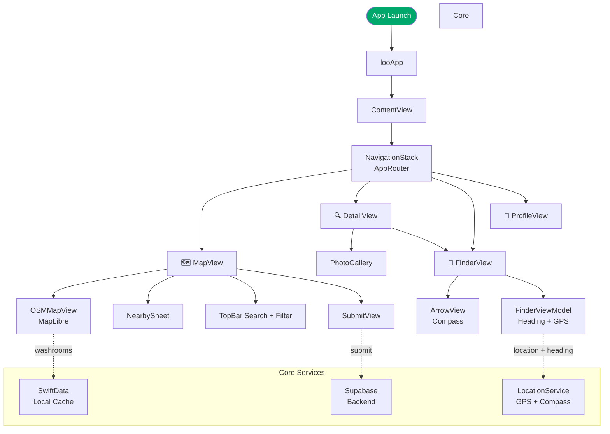
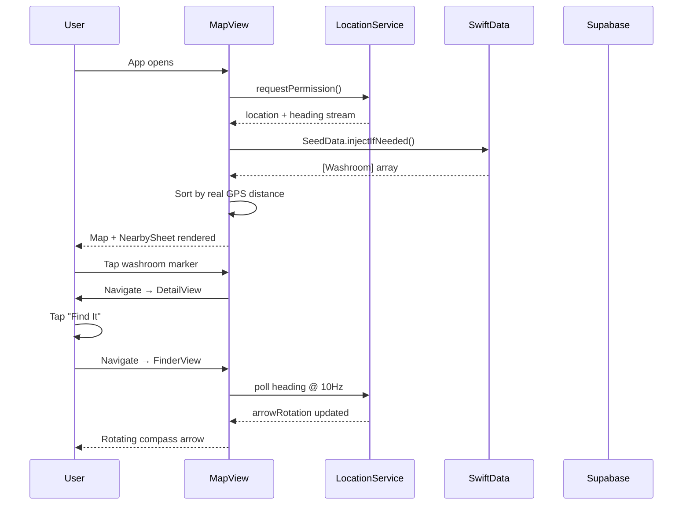
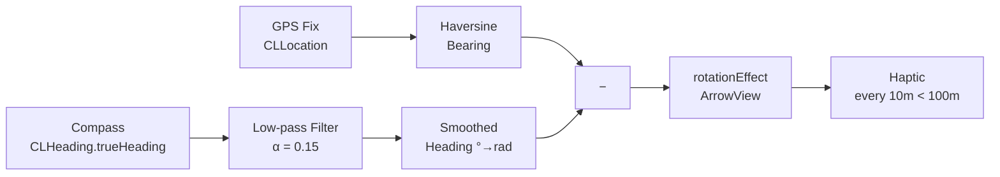

<br>

<div align="center">

# 🚻 Loo
### Find a clean washroom in Dhaka — fast.

*Community-powered · Free forever · Built for Bangladesh*

[](https://developer.apple.com/ios/)
[](https://swift.org)
[](https://developer.apple.com/xcode/swiftui/)
[](https://maplibre.org)
[](https://github.com/siraajul/Loo/pulls)
[](LICENSE)

</div>

---

> **Finding a clean public washroom in Dhaka is hard.**  
> Dead apps, outdated listings, zero community input.  
> Loo fixes that — open-source, OSM-powered, built by the community for the city.

---

## ✨ What it does

| Feature | Description |
|---|---|
| 🗺 **Live OSM Map** | OpenStreetMap tiles via MapLibre — no Google, no fees, always up to date |
| 📍 **Blue Dot + Auto-Center** | Snaps to your GPS position the moment location is granted |
| 🧭 **Compass Finder** | Real-time rotating arrow guides you turn-by-turn with haptic pulses as you get closer |
| 📋 **Nearby Sheet** | 5 closest washrooms sorted by live GPS distance, updating as you move |
| 🔍 **Detail View** | Rating, fee (৳), gender, accessibility ♿, bidet, soap, tissue, photos |
| ➕ **Submit a Washroom** | Crowdsource new locations with map preview and community review |
| 🎛 **Smart Filters** | Filter by type, gender, price, accessibility |
| 🔐 **Auth** | Phone OTP sign-in via Supabase — no email required |

---

## 📱 Screens

```
┌─────────────────┐  ┌─────────────────┐  ┌─────────────────┐
│   🗺 Map View   │  │  🧭 Finder View │  │  📋 Detail View │
│                 │  │                 │  │                 │
│  [OSM Dhaka]    │  │   Bashundhara   │  │  ★ 4.2  Free    │
│  📍 markers     │  │       ↑         │  │  ♿ Accessible   │
│                 │  │      ↑↑         │  │  🚿 Bidet       │
│ ┌─────────────┐ │  │    320 m        │  │  🧼 Soap        │
│ │ Nearby      │ │  │     away        │  │                 │
│ │ 🏪 320m 🕌  │ │  │ [Open in Maps]  │  │ [📸 Photos]     │
└─────────────────┘  └─────────────────┘  └─────────────────┘
```

---

## 🏗 Architecture

### App Flow



### Data Flow



### Layer Diagram

```
┌────────────────────────────────────────────────────┐
│                    SwiftUI Views                   │
│  MapView · DetailView · FinderView · SubmitView    │
├────────────────────────────────────────────────────┤
│                  ViewModels / State                │
│     MapViewModel · FinderViewModel · AppRouter     │
├──────────────────────┬─────────────────────────────┤
│   Core Services      │        Repositories         │
│  LocationService     │  WashroomRepository         │
│  HeadingService      │  SubmissionRepository       │
│  Geo · Formatting    │  AuthRepository             │
├──────────────────────┼─────────────────────────────┤
│   SwiftData (Local)  │   Supabase (Remote)         │
│   Washroom @Model    │   PostgreSQL + Auth + CDN   │
├──────────────────────┴─────────────────────────────┤
│              MapLibre GL Native                    │
│         OpenFreeMap OSM Vector Tiles               │
└────────────────────────────────────────────────────┘
```

---

## 🧠 How the Compass Works

The Finder screen gives you a real-time pointing arrow — no map needed, just walk.

```
arrowRotation = bearing(userLocation → target)  [radians, true north]
              − deviceHeading                    [radians, from CLHeading]
```



- **Single CLLocationManager** handles both GPS and compass — `trueHeading` is accurate because the same manager has location context for magnetic declination
- **Low-pass filter** smooths compass jitter without introducing noticeable lag
- **Haptic feedback** fires every 10 m bucket when within 100 m of the target

---

## 🗺 Why MapLibre + OpenFreeMap?

| | Google Maps | Apple Maps | **MapLibre + OpenFreeMap** |
|---|---|---|---|
| Cost | 💰 Pay per load | Free (limited) | ✅ **Free forever** |
| Bangladesh coverage | Moderate | Poor | ✅ **Excellent (HOT + OSM)** |
| Offline support | No | Limited | ✅ **Yes** |
| Open source | No | No | ✅ **Yes** |
| Custom styling | Paid | No | ✅ **Yes** |
| API key required | Yes | No | ✅ **No** |

---

## 🚀 Quick Start

### Requirements
- Xcode 15+
- iOS 17+ device (map tiles + compass need real hardware)
- Swift 5.9+

### Steps

```bash
# 1. Clone
git clone https://github.com/siraajul/Loo.git
cd Loo

# 2. Open in Xcode — MapLibre SPM resolves automatically
open loo.xcodeproj
```

**3. Add location permission** in the target's Build Settings:
```
INFOPLIST_KEY_NSLocationWhenInUseUsageDescription = Used to show washrooms near your location.
```

**4. (Optional) Supabase backend** — add your credentials to:
```swift
// loo/Core/Network/SupabaseClient.swift
let supabaseURL = URL(string: "https://your-project.supabase.co")!
let supabaseKey = "your-anon-key"
```

**5. Run on device** — the app seeds 10 real Dhaka washrooms on first launch so it works immediately, even without a backend.

---

## 🌱 Seed Data (Offline-first)

The app ships with 10 verified Dhaka washrooms so it's usable from day one:

| Washroom | Type | Fee |
|---|---|---|
| Bashundhara City Mall | 🏪 Mall | Free |
| Jamuna Future Park | 🏪 Mall | Free |
| Baitul Mukarram Mosque | 🕌 Mosque | Free |
| Square Hospital | 🏥 Hospital | Free |
| Dhanmondi Lake Park | 🚻 Public | ৳2 |
| Gulshan-1 DCC Market | 🚻 Public | ৳5 |
| Panthapath Petrol Pump | ⛽ Petrol Pump | Free |
| Star Kabab Restaurant | 🍴 Restaurant | Free |
| Motijheel Shapla Chatter | 🚻 Public | ৳3 |
| Uttara Sector-3 Park | 🚻 Public | Free |

---

## 🛠 Tech Stack

| Layer | Technology |
|---|---|
| **UI** | SwiftUI 5 |
| **Map** | MapLibre GL Native + OpenFreeMap (OSM vector tiles) |
| **Local DB** | SwiftData |
| **Backend** | Supabase (PostgreSQL + Auth + Storage) |
| **Location** | CoreLocation — GPS + compass heading |
| **State** | `@Observable` macro (iOS 17) |
| **Navigation** | `NavigationStack` + typed route enum |
| **Language** | Swift 5.9 |

---

## 🗺 Roadmap

### ✅ v0.1 — Foundation (Done)
- [x] OSM map with MapLibre GL Native
- [x] GPS blue dot + auto-center on user
- [x] Custom washroom markers (color-coded by gender/type)
- [x] Nearby sheet sorted by real GPS distance
- [x] Compass Finder with smooth arrow + haptics
- [x] Washroom detail view (rating, fee, accessibility, amenities)
- [x] Submit a washroom form with map preview
- [x] Filter sheet (type, gender, price, accessibility)
- [x] Phone OTP auth via Supabase
- [x] 10 seed washrooms for offline-first experience

### 🔨 v0.2 — Community (In Progress)
- [ ] Live Supabase sync — fetch real washroom data from backend
- [ ] Submit washroom → Supabase review queue
- [ ] Star ratings + written reviews
- [ ] Photo upload via Supabase Storage
- [ ] Moderator approval flow

### 🔭 v0.3 — Discovery
- [ ] Full-text search across washroom names and areas
- [ ] Search suggestions as you type
- [ ] Filter by "open now" (operating hours)
- [ ] Sort by rating, distance, or price
- [ ] Cluster markers at low zoom levels

### 🌍 v0.4 — Scale
- [ ] Offline tile caching (MapLibre offline packs)
- [ ] Push notifications for nearby new submissions
- [ ] Expand to Chittagong and Sylhet
- [ ] Android version (React Native or Kotlin Multiplatform)
- [ ] Import from OpenStreetMap `amenity=toilets` tag

### 💎 v1.0 — Polish
- [ ] App icon + launch screen
- [ ] Bangla language support (বাংলা UI)
- [ ] Accessibility — VoiceOver labels on all map markers
- [ ] Onboarding screen for first-time users
- [ ] TestFlight public beta

---

## 🤝 Contributing

**Dhaka has thousands of washrooms not yet on the map. This is a community project — every contribution matters.**

### Ways to contribute

| How | What |
|---|---|
| 🗺 **Add washrooms** | Open an Issue with the name, location, and details of a real Dhaka washroom |
| 🐛 **Report bugs** | [Open an Issue](https://github.com/siraajul/Loo/issues/new) with steps to reproduce |
| 💡 **Suggest features** | [Start a Discussion](https://github.com/siraajul/Loo/discussions) |
| 🔧 **Write code** | Pick any open Issue and submit a PR |
| 📸 **Add photos** | Once photo upload is live, document real washrooms |
| 🌐 **Translate** | Help with Bangla UI strings |

### Code contribution workflow

```bash
# 1. Fork the repo on GitHub

# 2. Clone your fork
git clone https://github.com/YOUR_USERNAME/Loo.git

# 3. Create a branch
git checkout -b feature/your-feature-name

# 4. Make your changes, then commit
git commit -m "feat: add your feature"

# 5. Push and open a PR against siraajul/Loo main
git push origin feature/your-feature-name
```

### Coding conventions
- SwiftUI views in `Features/<FeatureName>/`
- New data fields go on the `Washroom` SwiftData model
- Follow existing naming: `PascalCase` types, `camelCase` properties
- No force unwraps — use `guard let` or `if let`
- No comments explaining *what* code does — only *why* if non-obvious

### Good first issues
Look for issues tagged [`good first issue`](https://github.com/siraajul/Loo/issues?q=is%3Aopen+label%3A%22good+first+issue%22) — these are intentionally scoped and well-described.

---

## 📄 License

MIT © [siraajul](https://github.com/siraajul)

You're free to use, modify, and distribute this code. If you build something with it, a shoutout or star ⭐ is always appreciated.

---

<div align="center">

**⭐ Star this repo if Loo helped you find a clean washroom in Dhaka**

[Report Bug](https://github.com/siraajul/Loo/issues) · [Request Feature](https://github.com/siraajul/Loo/discussions) · [Submit a Washroom](https://github.com/siraajul/Loo/issues/new)

<sub>Built with ❤️ for Dhaka · Powered by OpenStreetMap contributors</sub>

</div>
